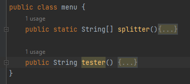

# Palindrome Tester

## main

The Main class simpliy runs the splitter method from the menu class.

## menu
The menu class contains two methods spliter and tester.

### Spliter
The spliter class take in the string sentence and seperate it into words and stores these words in an array called words.

### Tester
The tester method allows the user to choose which method of testing for palindromes they want to use and then calls said method. in the example below the code for choosing the Pali1 method is show however the code for the other two is very similar.

The method also has a default in the use case if the user doesn't enter a valid value.

## PaliInterface
The Palindrome interface sets the strucutre of all classes using the isPalindrome method.

## Pali1
Pali1 is the first class to test for palindromes and uses a for loop. All of the classes convert every character to lower case and removes spaces. 

## Pali2
Pali2 uses String Builders.

## Pali3
Pali3 uses a while loop.

## Main Test
This class was used to test all code, each Palindrome class was checked for a true and a false output.